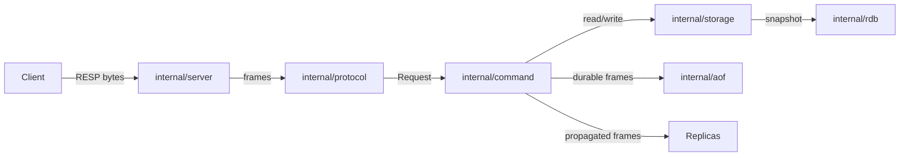

# Architecture overview

This repository is structured as a phase-by-phase implementation of a Redis-compatible TCP server in Go. The codebase now covers the raw TCP server, RESP parsing/encoding, sharded in-memory storage, transactions, pub/sub, replication, RDB snapshots, append-only-file durability, memory-pressure eviction, and basic operational observability while still keeping clear package seams for later phases.

For domain vocabulary, see [`CONTEXT.md`](../../CONTEXT.md) at the repository root.

## Request flow

## Package layout

### `cmd/stash`

Contains the `main` package and the production binary entrypoint. It is responsible for:

- parsing runtime flags
- creating the logger, store, command executor, and TCP server
- starting the server with signal-aware shutdown

### `internal/config`

Holds startup configuration such as host, port, log level, TTL eviction settings, persistence paths, replication/auth settings, `maxmemory`, and slowlog threshold. Every flag is documented in the [configuration reference](../reference/configuration.md).

### `internal/logger`

Provides a small `log/slog` initializer so the whole server shares one structured logging setup.

### `internal/aof`

Owns append-only-file durability.

Current responsibilities:

- replay RESP command streams on startup before the listener opens
- append successful mutating commands in RESP form
- apply `appendfsync` policies (`always`, `everysec`, `no`)
- rewrite the current durable state in the background for `BGREWRITEAOF`

### `internal/protocol`

Owns RESP parsing and encoding.

Current responsibilities:

- parse RESP2 frames from a buffered TCP reader
- decode RESP frames incrementally from byte buffers without blocking, reporting incomplete frames distinctly from protocol errors
- handle fragmented bulk strings and arrays correctly
- encode simple strings, errors, integers, bulk strings, and arrays
- include minimal RESP3 placeholder types (`Boolean`, `Null`) for future expansion

### `internal/storage`

Owns the in-memory key/value store.

Current responsibilities:

- route keys to a fixed shard set and protect each shard with its own `sync.RWMutex`
- support strings, hashes, lists, sets, sorted sets, and streams through a unified value model
- store TTLs in Unix milliseconds
- perform passive eviction on reads
- perform active eviction in a background loop, naming the keys each pass removed so the server can replicate and persist those deletions
- track approximate keyspace memory when `maxmemory` is enabled
- evict sampled least-recently-used candidates under memory pressure

### `internal/command`

Translates RESP arrays into executable requests and dispatches them to handlers.

Current command surface includes strings, bitmaps, HyperLogLog, hashes, lists, sets, sorted sets, geospatial commands, streams, transactions, pub/sub, replication handshakes, `WAIT`, `BGREWRITEAOF`, `INFO`, `SLOWLOG`, and `MONITOR`. Each command is registered in a single `commandSpecs` table carrying its handler, argument validator, and replication/durability flags; the [command reference](../reference/commands.md) is the reader-facing view of that table.

### `internal/server`

Owns the TCP lifecycle.

Current responsibilities:

- create the listener with `net.Listen`
- accept client connections in a loop
- spawn one goroutine per client (default networking mode)
- parse → execute → respond for each request
- provide a non-blocking connection state machine that buffers reads, parses complete requests, buffers responses, and flushes output incrementally
- optionally serve all clients from one event-loop goroutine driven by OS readiness notifications (`--event-loop`), dispatching readable and writable sockets through per-connection state machines
- maintain an active connection registry for shutdown
- load startup persistence (RDB and/or AOF) before accepting TCP connections
- append durable command frames and fan out replication writes after successful execution
- maintain monitor and slowlog registries for operational visibility
- expose server stats used by `INFO`
- stop cleanly when the process receives `SIGINT` or `SIGTERM`

### `test`

Contains integration tests that verify the server end to end over a real TCP connection.

## Design notes

### Why shard-local store locks?

The store now uses a fixed shard set with one `sync.RWMutex` per shard. Single-key commands only lock the owning shard, while multi-key commands group keys by shard and lock shard IDs in deterministic order to avoid deadlocks.

### Why RESP3 placeholders now?

The user requested RESP3-aware structure, but full RESP3 support is out of scope for the current implementation. The protocol package therefore exposes lightweight placeholder types so later expansion does not require redesigning the core abstraction.

### Why an opt-in event loop?

The `--event-loop` flag replaces goroutine-per-connection networking with a single event-loop goroutine backed by OS I/O multiplexing, so many idle connections cost file descriptors instead of goroutine stacks.

Platform support boundary:

- Linux uses `epoll` and macOS uses `kqueue`, both through the standard-library `syscall` package with level-triggered readiness.
- Every other platform (including Windows) logs a warning and falls back to the default goroutine-per-connection path, so the flag is safe to set everywhere.

Inside the loop, each accepted socket is set non-blocking and owned by a connection state machine: readable sockets feed buffered bytes into request parsing and command execution, and writable sockets flush pending RESP output under backpressure. Asynchronous deliveries produced by other connections (pub/sub messages, monitor events, replication payloads) are handed to the loop through a locked per-connection push queue plus a poller wakeup, keeping all socket writes ordered through the machine's single write buffer.

Backpressure and memory safety: requests are executed one at a time with flushes interleaved, and both reading and execution pause for a connection whose buffered output passes a high-water mark, resuming when the socket drains. Buffered output is capped per connection, so a consumer that stops draining its socket is disconnected instead of growing server memory — the event-loop replacement for the per-write deadlines the goroutine path applies to pub/sub and monitor deliveries. When the peer half-closes, the already-parsed pipeline tail is served and its replies drained before the connection closes.

Scope note: commands execute inline on the loop goroutine, so a command that would block (`BLPOP` on an empty list, `WAIT` that must wait for replica acknowledgements) fails with an explicit error in event-loop mode rather than stalling every connection; immediately satisfiable forms still succeed. The goroutine-per-connection path remains the default.

### Why keep persistence separate from replication?

Replication and AOF both reuse RESP-encoded command frames, but they serve different correctness goals:

- replication forwards commands to live replicas
- AOF records only durable state mutations for crash recovery

Keeping those paths separate lets the server replicate transient commands like `PUBLISH` without persisting them, while still logging durable commands such as `XADD` even when they are not part of the replication handshake flow.
